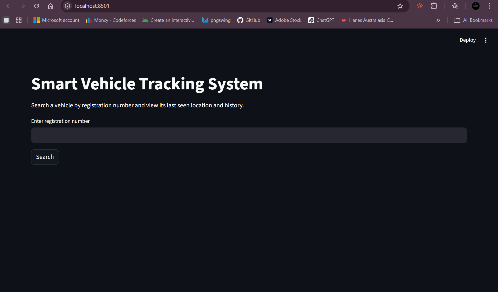
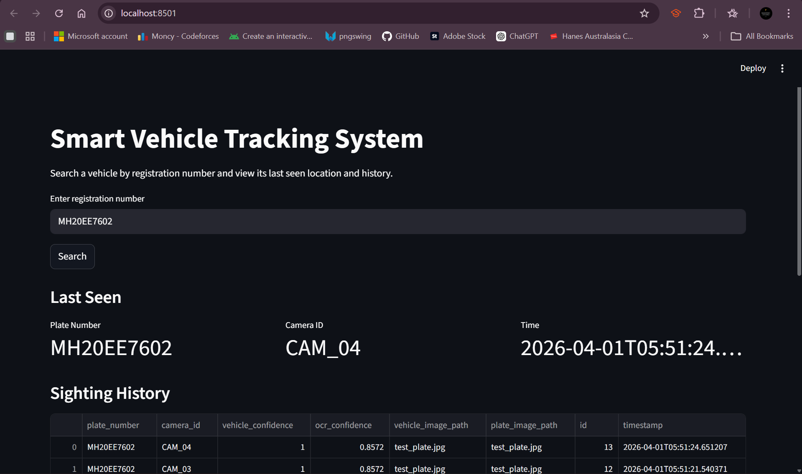
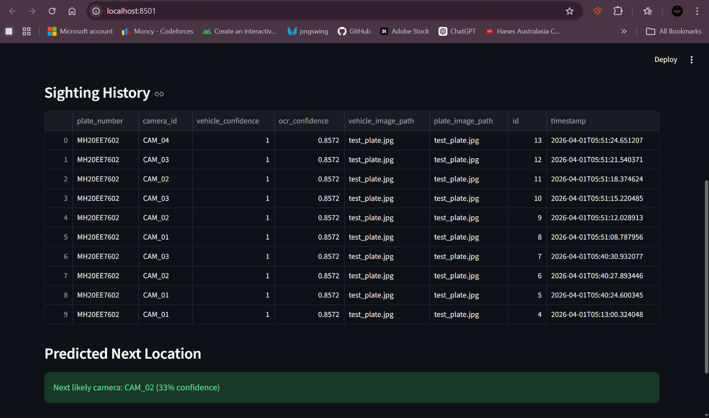

# 🚗 Smart Vehicle Tracking System using AI

## 📌 Overview

This project is an AI-powered vehicle tracking system that detects vehicle registration numbers from images, stores spatiotemporal data, and predicts the next likely location of the vehicle based on historical movement patterns.

The system integrates **Computer Vision, OCR, Backend APIs, Database, and a Dashboard**, making it a full-stack AI application.

---

## 🎯 Features

* 🔍 **Number Plate Detection (OCR)**

  * Extracts vehicle registration numbers from images using EasyOCR

* 🗄️ **Event Storage**

  * Stores detected vehicle data (plate, camera, timestamp) in a database

* 🔎 **Search System**

  * Search any vehicle by registration number

* 📊 **Vehicle History**

  * View full movement history across cameras

* 📍 **Last Seen Location**

  * Shows most recent camera and timestamp

* 🔮 **Route Prediction**

  * Predicts the next likely camera using transition-based probability

* 🖥️ **Interactive Dashboard**

  * Built using Streamlit for easy visualization

---

## 🧠 System Architecture

```text
Image → OCR → Backend API → Database → Dashboard → Prediction
```

---

## 🛠️ Tech Stack

### AI / Computer Vision

* Python
* OpenCV
* EasyOCR

### Backend

* FastAPI
* Uvicorn

### Database

* SQLite
* SQLAlchemy

### Frontend

* Streamlit

### Others

* Pandas
* Requests

---

## 📁 Project Structure

```text
AI-Traffic-Vehicle-Tracking-System/
│
├── app/                # Backend (FastAPI)
├── detection/          # OCR & processing pipeline
├── dashboard/          # Streamlit UI
├── data/               # Input data
├── outputs/            # Processed images
├── run_pipeline.py     # Runs detection pipeline
├── requirements.txt
└── README.md
```

---

## 🚀 How to Run

### 1️⃣ Clone the repository

```bash
git clone https://github.com/moncy-code/AI-Traffic-Vehicle-Tracking-System

cd AI-Traffic-Vehicle-Tracking-System
```

---

### 2️⃣ Create virtual environment

```bash
python -m venv venv
venv\Scripts\activate
```

---

### 3️⃣ Install dependencies

```bash
pip install -r requirements.txt
```

---

### 4️⃣ Start backend server

```bash
python -m uvicorn app.main:app --reload
```

---

### 5️⃣ Run detection pipeline

```bash
python run_pipeline.py
```

---

### 6️⃣ Launch dashboard

```bash
python -m streamlit run dashboard/streamlit_app.py
```

---

## 📊 Example Output

* Plate detected: `MH20EE7602`
* Last seen: `CAM_03`
* Prediction: `CAM_02 (33% confidence)`

---

## ⚠️ Limitations

* OCR accuracy depends on image quality
* Uses simulated camera data (not real city-scale system)
* Prediction is based on simple transition probabilities

---

## 🔮 Future Improvements

* 🚀 YOLO-based number plate detection
* 🗺️ Map-based visualization of vehicle movement
* ☁️ Cloud deployment (AWS / Docker)
* 📡 Real-time video stream processing
* 🔍 Vehicle re-identification (beyond plate)

---

## 📌 Use Case

* Smart traffic monitoring systems
* Vehicle tracking and analytics
* Urban mobility analysis
* Security and surveillance research

---

## 📸 Screenshots

### 🏠 Dashboard Home


---

### 🔎 Vehicle Search Result




## 👨‍💻 Author

**Moncy Kunjumon**
Master of Artificial Intelligence – RMIT University

---

## ⭐ Acknowledgements

* EasyOCR
* FastAPI
* Streamlit
* OpenCV


